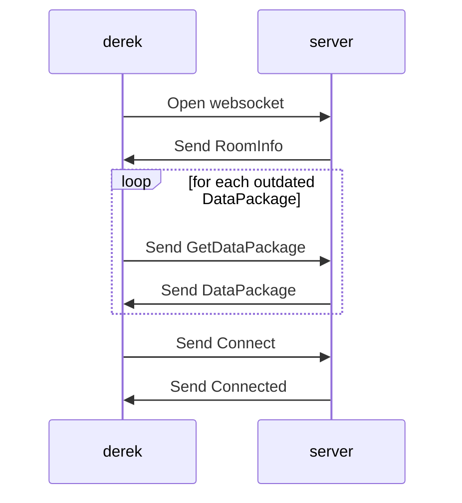

### go-derek-go

## (Server -> Client)
These packets are are sent from the multiworld server to the client. They are not messages which the server accepts.
* [RoomInfo](#RoomInfo)
* [ConnectionRefused](#ConnectionRefused)
* [Connected](#Connected)
* [ReceivedItems](#ReceivedItems)
* [LocationInfo](#LocationInfo)
* [RoomUpdate](#RoomUpdate)
* [PrintJSON](#PrintJSON)
* [DataPackage](#DataPackage)
* [Bounced](#Bounced)
* [InvalidPacket](#InvalidPacket)
* [Retrieved](#Retrieved)
* [SetReply](#SetReply)

## (Client -> Server)
These packets are sent purely from client to server. They are not accepted by clients.

* [Connect](#Connect)
* [Sync](#Sync)
* [LocationChecks](#LocationChecks)
* [LocationScouts](#LocationScouts)
* [StatusUpdate](#StatusUpdate)
* [Say](#Say)
* [GetDataPackage](#GetDataPackage)
* [Bounce](#Bounce)
* [Get](#Get)
* [Set](#Set)
* [SetNotify](#SetNotify)